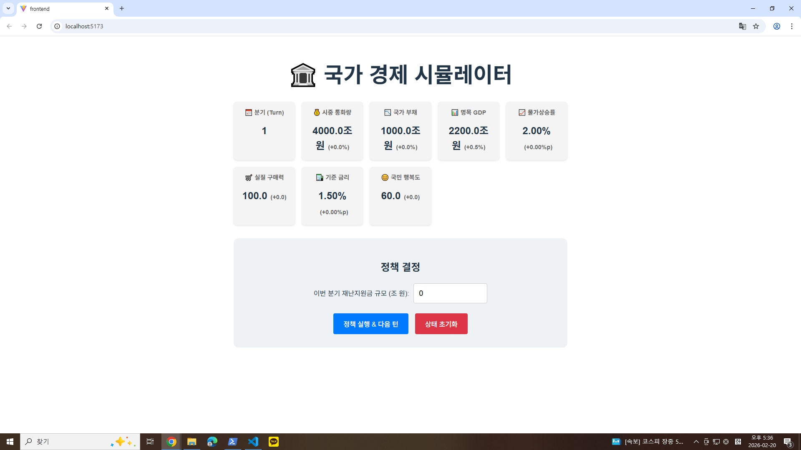
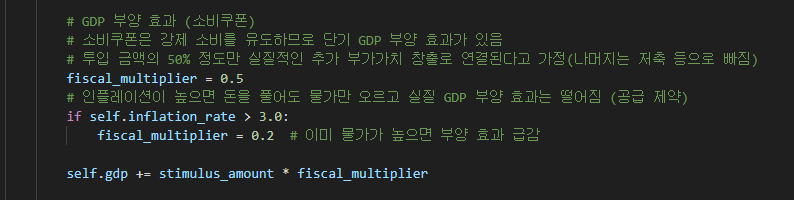
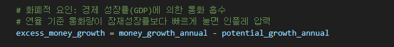
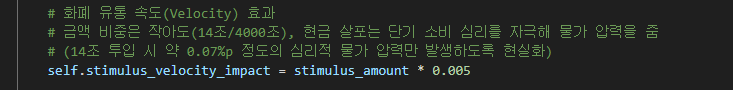
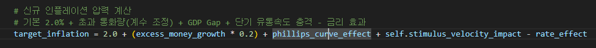
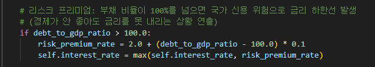
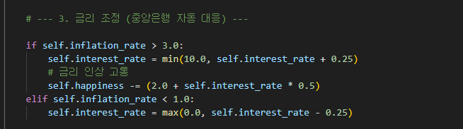
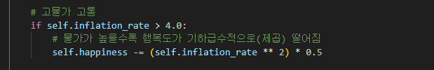
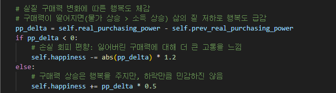
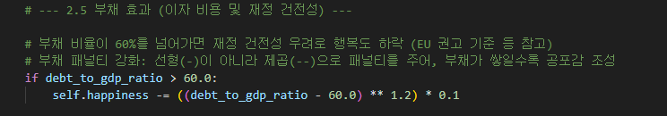

# 🏛️ 국가 경제 시뮬레이터 (National Economy Simulator)

## 📖 프로젝트 소개
**"민생회복 소비쿠폰이나 재난지원금 같은 재정 정책이 우리 경제에 어떤 영향을 미칠까?"**

이 프로젝트는 국가의 현금성 지원 정책(재난지원금, 소비쿠폰 등)이 거시경제 지표(인플레이션, 금리, GDP, 국가 부채, 실질 구매력 등)에 미치는 연쇄적인 영향을 시뮬레이션해 보는 웹 애플리케이션입니다. 단순한 수치 변화가 아닌, 실제 경제학적 원리(승수효과, 필립스 곡선, 구축효과 등)를 백엔드 로직에 반영하여 정책의 명암을 가시적으로 확인할 수 있도록 구현했습니다.

- **개발 기간:** 2026.02.12 ~ 2026.02.19 (8일)
- **개발 인원:** 1인 개발 (개인 포트폴리오)



## 🛠 기술 스택 (Tech Stack)
### Backend
- **Language:** Python 3.14
- **Framework:** FastAPI
- **Server:** Uvicorn
- **Architecture:** 경제 시뮬레이션 코어 객체(`EconomySimulation`)를 통한 상태 관리 및 API 제공

### Frontend
- **Language:** TypeScript
- **Library:** React 19
- **Build Tool:** Vite
- **Styling:** CSS3 (반응형 대시보드 및 경고 UI 구현)

## ✨ 주요 기능 및 핵심 로직
본 시뮬레이터는 매 분기(Turn)마다 투입되는 **지원금 규모**를 결정하면, 백엔드에서 다음의 경제학적 원리를 바탕으로 시장 반응을 계산하여 반환합니다.

1. **승수 효과 및 GDP 부양 (Multiplier Effect)**
   - 투입된 지원금이 시중 통화량을 증가시키고 단기적인 명목 GDP 성장을 견인합니다.
   - 단, 인플레이션이 심화된 상태에서는 실질적인 부가가치 창출(부양 효과)이 급감하도록 설계되었습니다.
   
2. **물가 상승 및 인플레이션 (Inflation & Phillips Curve)**
   - 통화량이 잠재성장률보다 빠르게 늘어나거나, 실제 성장률이 잠재성장률을 초과(GDP Gap)할 경우 물가 상승 압력이 가중됩니다.
   
   - 소비쿠폰 지급으로 인한 단기 화폐 유통 속도(Velocity) 증가 충격을 반영했습니다.
   
   
   (화페 유통 속도는 인플레이션 상승에 영향을 줍니다.)
   
3. **국가 부채와 구축 효과 (Crowding-out Effect)**
   - 지원금 재원을 적자 국채로 조달한다고 가정하여 국가 부채가 증가합니다.
   - GDP 대비 부채 비율이 일정 수준을 초과하면 경제 성장률을 갉아먹고, 리스크 프리미엄이 발생해 금리 하한선이 상승합니다.
   
4. **금리 자동 조정 및 국민 행복도 (Interest Rate & Happiness)**
   - 인플레이션이 목표치를 상회하면 가상의 중앙은행이 기준금리를 인상하여 물가를 억제합니다.
   
   - 금리 상승, 고물가, 실질 구매력 저하, 과도한 부채 비율은 최종적으로 '국민 행복도' 수치를 기하급수적으로 하락시킵니다.
   <br/>
   <br/>
   (고물가로 인한 행복도 변화)
   
   <br/>
   (실질 구매력에 따른 행복도 변화)
   
   <br/>
   (부채 비율에 따른 행복도 변화)
   
## 🚀 설치 및 실행 방법

루트 디렉토리의 `package.json`에 설정된 `concurrently`를 통해 백엔드와 프론트엔드를 한 번에 실행할 수 있습니다.

### 1. 사전 요구사항
- Node.js (v18 이상 권장)
- Python (3.14 권장)

### 2. 패키지 설치
```bash
# 1. 프론트엔드 및 루트 패키지 설치
npm install

# 2. 백엔드 패키지 설치
cd backend
pip install -r requirements.txt
cd ..

```

### 3. 프로젝트 실행

루트 폴더에서 다음 명령어를 실행하면 FastAPI 서버(8000포트)와 Vite 개발 서버가 동시에 기동됩니다.

```bash
npm run dev

```


